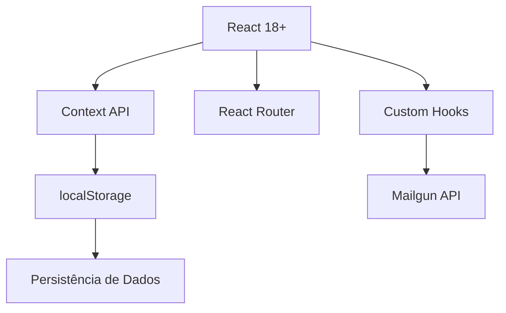

# 💇‍♀️ SalãoPro - Sistema de Gestão Completo

<div align="center">


**Plataforma completa para gestão de salões de beleza e clínicas estéticas**

[Demo](#-demo) • [Instalação](#-instalação) • [Documentação](#-documentação-técnica) • [Contribuir](#-contribuindo)

</div>

---

## 📋 Índice

- [Visão Geral](#-visão-geral)
- [Funcionalidades Principais](#-funcionalidades-principais)
- [Arquitetura do Sistema](#-arquitetura-do-sistema)
- [Estrutura de Diretórios](#-estrutura-de-diretórios)
- [Mapa de Arquivos](#-mapa-de-arquivos-por-funcionalidade)
- [Instalação e Configuração](#-instalação-e-configuração)
- [Documentação Técnica](#-documentação-técnica)
- [Guia de Atualização](#-guia-de-atualização)
- [Contribuindo](#-contribuindo)

---

## 🎯 Visão Geral

O **SalãoPro** é uma solução web completa desenvolvida em React para otimizar a gestão de salões de beleza, oferecendo controle total sobre:

- 📅 **Agendamentos** - Sistema completo com 4 visualizações e notificações automáticas
- 👥 **Clientes** - Cadastro, histórico detalhado e estatísticas
- 💼 **Serviços** - Catálogo com 150+ serviços pré-cadastrados
- 🛒 **Produtos** - PDV integrado com controle de estoque
- 💰 **Financeiro** - Receitas, despesas e relatórios completos
- 📊 **Relatórios** - Análises avançadas e KPIs
- 🌐 **Agenda Online** - Sistema público com sincronização em tempo real
- ⭐ **Avaliações** - Feedback pós-atendimento automatizado
- 📧 **Notificações** - Sistema completo via Mailgun

### 🌟 Diferenciais Técnicos

- ✅ **Arquitetura Modular** - Fácil manutenção e expansão
- ✅ **Real-time** - Sincronização automática via localStorage events
- ✅ **Sem Backend** - 100% frontend com persistência local
- ✅ **Sistema de Planos** - 6 níveis com restrições configuráveis
- ✅ **Multi-salão** - Suporte para múltiplos estabelecimentos
- ✅ **Design Responsivo** - Mobile-first approach
- ✅ **Email Transacional** - Integração completa com Mailgun

---

## ✨ Funcionalidades Principais

### 📅 Sistema de Agendamentos

<details>
<summary><b>Visualizações e Recursos (clique para expandir)</b></summary>

#### 4 Modos de Visualização:
1. **Lista** - Tabela completa com filtros avançados
2. **Dia** - Grade horária por profissional (30 em 30min)
3. **Semana** - Visão compacta de 7 dias
4. **Calendário** - Visão mensal estilo calendário

#### Recursos Principais:
- ✅ Validação automática de conflitos
- ✅ Bloqueio de horários (almoço, reuniões, folgas)
- ✅ Notificações automáticas (confirmação, alteração, cancelamento)
- ✅ Sistema de avaliação pós-atendimento
- ✅ Agenda online pública com sincronização em tempo real
- ✅ Filtros por cliente, serviço, profissional, status

#### Arquivos Relacionados:
```
src/pages/Agendamentos.jsx (página principal)
src/components/agendamentos/
  ├── AgendamentoCalendario.jsx
  ├── AgendamentoDia.jsx
  ├── AgendamentoSemana.jsx
  ├── AgendamentoLista.jsx
  ├── AgendamentoFormulario.jsx
  ├── AgendamentoHeader.jsx
  ├── AgendamentoFiltros.jsx
  └── BloqueioHorarioForm.jsx
```

</details>

### 🌐 Agenda Online Pública

<details>
<summary><b>Sistema de Agendamento Online (clique para expandir)</b></summary>

#### Características:
- ⚡ **Sincronização em tempo real** (2s de intervalo)
- 🔄 Atualização automática de horários disponíveis
- ⚠️ Alerta se horário ficar ocupado durante seleção
- 📧 Email de confirmação automático
- 📊 Validação de conflitos em tempo real
- 🎨 Design moderno com gradientes

#### Fluxo de 3 Passos:
1. **Dados Pessoais** - Nome, telefone, email
2. **Escolha do Serviço** - Cards visuais com descrições
3. **Data e Horário** - Seleção com validação em tempo real

#### Arquivos Relacionados:
```
src/pages/AgendaOnline.jsx (página principal)
src/components/agendaOnline/
  ├── AgendaStepDados.jsx
  ├── AgendaStepServico.jsx
  ├── AgendaStepDataHora.jsx
  ├── AgendaStepIndicator.jsx
  ├── AgendaHeader.jsx
  ├── AgendaLoading.jsx
  ├── AgendaError.jsx
  ├── AgendaSucesso.jsx
  └── RealtimeIndicator.jsx
src/hooks/useRealtimeAgendamentos.js
```

</details>

### 📧 Sistema de Notificações

<details>
<summary><b>Emails Automáticos e Histórico (clique para expandir)</b></summary>

#### 5 Tipos de Notificação:
1. **Confirmação** ✅ - Ao criar agendamento
2. **Alteração** 🔄 - Ao modificar data/horário
3. **Cancelamento** ❌ - Ao excluir agendamento
4. **Avaliação** ⭐ - Após conclusão do atendimento
5. **Aniversário** 🎂 - Automático ou manual

#### Recursos Avançados:
- ✅ Templates HTML responsivos personalizáveis
- ✅ Variáveis dinâmicas (`{cliente_nome}`, `{data}`, etc.)
- ✅ Histórico completo de emails enviados
- ✅ Status de envio (enviado/falhado)
- ✅ Configuração individual por salão
- ✅ Modo automático para aniversários
- ✅ Dias de antecedência configuráveis

#### Arquivos Relacionados:
```
src/services/
  ├── mailgunService.js (integração Mailgun)
  ├── notificationService.js (lógica de notificações)
  └── emailService.js (simulação para dev)
src/config/mailgunConfig.js
src/hooks/useEmailHistorico.js
src/components/clientes/ClienteDetalhes.jsx (aba Emails)
src/components/Configuracoes/ConfiguracoesComunicacoes.jsx
```

</details>

### 💰 Sistema Financeiro

<details>
<summary><b>Controle Completo de Receitas e Despesas (clique para expandir)</b></summary>

#### Recursos:
- ✅ Lançamentos manuais e automáticos (PDV)
- ✅ Categorias predefinidas
- ✅ Múltiplas formas de pagamento
- ✅ Status (pago, pendente, recebido)
- ✅ Filtros avançados (data, categoria, status, busca)
- ✅ Gráficos e estatísticas
- ✅ Fluxo de caixa (6 meses)

#### Arquivos Relacionados:
```
src/pages/Financeiro.jsx
src/components/financeiro/
  ├── FinanceiroHeader.jsx
  ├── FinanceiroStats.jsx
  ├── FinanceiroTable.jsx
  ├── FinanceiroDetails.jsx
  └── TransacaoModal.jsx
src/hooks/
  ├── useFinanceiroData.js
  ├── useFinanceiroFilters.js
  └── useTransacaoForm.js
```

</details>

### 🛒 PDV (Ponto de Venda)

<details>
<summary><b>Sistema de Vendas Integrado (clique para expandir)</b></summary>

#### Funcionalidades:
- ✅ Grid de produtos com busca e filtros
- ✅ Carrinho lateral
- ✅ Desconto configurável (%)
- ✅ Múltiplas formas de pagamento
- ✅ Vinculação com cliente (opcional)
- ✅ Atualização automática de estoque
- ✅ Lançamento no financeiro
- ✅ Cálculo de lucro em tempo real

#### Arquivos Relacionados:
```
src/pages/Produtos.jsx
src/components/produtos/
  ├── PDVProdutoCard.jsx
  ├── PDVCarrinho.jsx
  ├── PDVCheckout.jsx
  ├── PDVPagamentoModal.jsx
  ├── EstoqueList.jsx
  ├── ProdutoModal.jsx
  ├── FornecedoresList.jsx
  └── FornecedorModal.jsx
src/hooks/usePDV.js
```

</details>

### 👥 Gestão de Clientes

<details>
<summary><b>Cadastro e Histórico Completo (clique para expandir)</b></summary>

#### 4 Abas de Informação:
1. **Informações** - Dados pessoais e estatísticas
2. **Agendamentos** - Histórico completo de atendimentos
3. **Compras** - Produtos adquiridos no PDV
4. **Emails** - Histórico de comunicações enviadas

#### Recursos:
- ✅ Estatísticas individuais (total gasto, ticket médio, visitas)
- ✅ Status ativo/inativo
- ✅ Filtros e busca avançada
- ✅ Limite por plano

#### Arquivos Relacionados:
```
src/pages/Clientes.jsx
src/components/clientes/
  ├── ClienteDetalhes.jsx (modal completo)
  └── AvaliacaoModal.jsx
```

</details>

### ⚙️ Configurações do Sistema

<details>
<summary><b>4 Seções de Configuração (clique para expandir)</b></summary>

#### 1. Informações Gerais
- Upload de logo
- Dados do salão
- Endereço e contatos

#### 2. Categorias e Serviços
- 150+ serviços pré-cadastrados
- Estrutura hierárquica (Categoria → Subcategoria → Serviços)
- Descrições automáticas

#### 3. Profissionais
- Cadastro com especialidades
- Limite por plano
- Vinculação com serviços

#### 4. Comunicações
- Links compartilháveis (agenda online, avaliação)
- Configuração de notificações (5 tipos)
- Editor de templates com variáveis
- Restaurar templates padrão

#### Arquivos Relacionados:
```
src/pages/Configuracoes.jsx
src/components/Configuracoes/
  ├── ConfiguracoesHeader.jsx
  ├── ConfiguracoesTabs.jsx
  ├── ConfiguracoesGeral.jsx
  ├── ConfiguracoesCategorias.jsx
  ├── ConfiguracoesProfissionais.jsx
  ├── ConfiguracoesComunicacoes.jsx
  ├── ProfissionalModal.jsx
  └── ServicoInfoModal.jsx
src/data/
  ├── categoriasServicosData.js
  └── servicosDescricoesData.js
```

</details>

---

## 🏗️ Arquitetura do Sistema

### Stack Tecnológico



### Fluxo de Dados

```
┌─────────────────────────────────────────────┐
│           AuthContext (Autenticação)        │
│  - currentUser                              │
│  - login() / register() / logout()          │
└──────────────────┬──────────────────────────┘
                   │
┌──────────────────▼──────────────────────────┐
│         SalaoContext (Estado Global)        │
│  - saloes, clientes, profissionais          │
│  - servicos, produtos, agendamentos         │
│  - transacoes, fornecedores                 │
│  - Funções CRUD para cada entidade          │
└──────────────────┬──────────────────────────┘
                   │
┌──────────────────▼──────────────────────────┐
│            localStorage (Persistência)      │
│  - Debounce de 300ms                        │
│  - Sincronização automática                 │
│  - Storage events para real-time            │
└─────────────────────────────────────────────┘
```

### Padrões de Design Utilizados

- **Context API** - Gerenciamento de estado global
- **Custom Hooks** - Lógica reutilizável
- **Component Composition** - Componentização modular
- **Render Props** - Compartilhamento de lógica
- **Higher-Order Functions** - Manipulação de dados
- **Factory Pattern** - Geração de templates de email

---

## 📁 Estrutura de Diretórios

```
salao-gestao/
│
├── public/              # Arquivos públicos
│   └── vite.svg
│
├── src/
│   ├── components/      # ⚛️ Componentes React (60+ arquivos)
│   │   ├── agendamentos/       # 8 componentes
│   │   ├── agendaOnline/       # 8 componentes
│   │   ├── auth/               # 2 componentes
│   │   ├── clientes/           # 2 componentes
│   │   ├── Configuracoes/      # 8 componentes
│   │   ├── financeiro/         # 5 componentes
│   │   ├── layout/             # 2 componentes
│   │   ├── perfil/             # 5 componentes
│   │   ├── produtos/           # 12 componentes
│   │   ├── relatorios/         # 3 componentes
│   │   ├── servicos/           # 5 componentes
│   │   ├── MaskedInput.jsx
│   │   ├── Modal.jsx
│   │   └── PlanRestriction.jsx
│   │
│   ├── config/          # ⚙️ Configurações
│   │   └── mailgunConfig.js
│   │
│   ├── context/         # 🔄 Contextos React
│   │   ├── AuthContext.jsx
│   │   └── SalaoContext.jsx
│   │
│   ├── data/            # 📊 Dados estáticos
│   │   ├── categoriasServicosData.js
│   │   ├── planosData.js
│   │   └── servicosDescricoesData.js
│   │
│   ├── hooks/           # 🎣 Custom Hooks
│   │   ├── AgendamentoHooks.jsx
│   │   ├── useEmailHistorico.js
│   │   ├── useFinanceiroData.js
│   │   ├── useFinanceiroFilters.js
│   │   ├── usePDV.js
│   │   ├── useRealtimeAgendamentos.js
│   │   └── useTransacaoForm.js
│   │
│   ├── pages/           # 📄 Páginas (16 arquivos)
│   │   ├── landing/            # 6 páginas
│   │   ├── Agendamentos.jsx
│   │   ├── AgendaOnline.jsx
│   │   ├── Avaliacao.jsx
│   │   ├── Clientes.jsx
│   │   ├── Configuracoes.jsx
│   │   ├── Dashboard.jsx
│   │   ├── Financeiro.jsx
│   │   ├── Perfil.jsx
│   │   ├── Produtos.jsx
│   │   ├── Relatorios.jsx
│   │   └── Servicos.jsx
│   │
│   ├── services/        # 🔧 Serviços
│   │   ├── emailService.js
│   │   ├── mailgunService.js
│   │   └── notificationService.js
│   │
│   ├── utils/           # 🛠️ Utilitários
│   │   ├── planRestrictions/   # 7 arquivos
│   │   ├── agendamentoUtils.js
│   │   └── masks.js
│   │
│   ├── App.jsx          # 🎯 Componente raiz
│   ├── main.jsx         # 🚀 Entry point
│   └── index.css        # 🎨 Estilos globais
│
├── .env.example         # 📝 Exemplo de variáveis
├── .gitignore
├── index.html
├── package.json
├── README.md
└── vite.config.js
```

---

## 🗺️ Mapa de Arquivos por Funcionalidade

### 📅 AGENDAMENTOS

<details>
<summary><b>15 arquivos relacionados (clique para expandir)</b></summary>

#### Página Principal
- `src/pages/Agendamentos.jsx` - Página completa com 4 visualizações

#### Componentes de Visualização
- `src/components/agendamentos/AgendamentoCalendario.jsx` - Visão mensal
- `src/components/agendamentos/AgendamentoDia.jsx` - Grade horária
- `src/components/agendamentos/AgendamentoSemana.jsx` - Visão semanal
- `src/components/agendamentos/AgendamentoLista.jsx` - Tabela completa

#### Componentes de Controle
- `src/components/agendamentos/AgendamentoHeader.jsx` - Cabeçalho e navegação
- `src/components/agendamentos/AgendamentoFiltros.jsx` - Barra de filtros
- `src/components/agendamentos/AgendamentoFormulario.jsx` - Form de criar/editar
- `src/components/agendamentos/BloqueioHorarioForm.jsx` - Bloqueio de horários

#### Utilitários
- `src/utils/agendamentoUtils.js` - Funções auxiliares (formatação, validação)
- `src/hooks/AgendamentoHooks.jsx` - Hooks Firebase (se integrado)

#### Contexto
- `src/context/SalaoContext.jsx` - Gerenciamento de agendamentos

#### Rotas
- `src/App.jsx` - Rota `/agendamentos`

</details>

### 🌐 AGENDA ONLINE

<details>
<summary><b>11 arquivos relacionados (clique para expandir)</b></summary>

#### Página Principal
- `src/pages/AgendaOnline.jsx` - Lógica principal e fluxo de 3 passos

#### Componentes dos Passos
- `src/components/agendaOnline/AgendaStepDados.jsx` - Passo 1: Dados pessoais
- `src/components/agendaOnline/AgendaStepServico.jsx` - Passo 2: Escolha do serviço
- `src/components/agendaOnline/AgendaStepDataHora.jsx` - Passo 3: Data e horário

#### Componentes de UI
- `src/components/agendaOnline/AgendaStepIndicator.jsx` - Barra de progresso
- `src/components/agendaOnline/AgendaHeader.jsx` - Cabeçalho do salão
- `src/components/agendaOnline/AgendaLoading.jsx` - Tela de carregamento
- `src/components/agendaOnline/AgendaError.jsx` - Tela de erro
- `src/components/agendaOnline/AgendaSucesso.jsx` - Confirmação de sucesso
- `src/components/agendaOnline/RealtimeIndicator.jsx` - Indicador de sincronização

#### Hooks
- `src/hooks/useRealtimeAgendamentos.js` - Sincronização em tempo real

#### Rotas
- `src/App.jsx` - Rota `/agenda/:salaoId`

</details>

### 📧 NOTIFICAÇÕES E EMAILS

<details>
<summary><b>9 arquivos relacionados (clique para expandir)</b></summary>

#### Serviços de Email
- `src/services/mailgunService.js` - Integração Mailgun (5 templates HTML)
- `src/services/emailService.js` - Simulação para desenvolvimento
- `src/services/notificationService.js` - Lógica de notificações automáticas

#### Configuração
- `src/config/mailgunConfig.js` - Configuração Mailgun

#### Hooks
- `src/hooks/useEmailHistorico.js` - Gerenciamento de histórico

#### Componentes de Configuração
- `src/components/Configuracoes/ConfiguracoesComunicacoes.jsx` - Painel completo
- `src/components/clientes/ClienteDetalhes.jsx` - Aba "Emails" do histórico

#### Contexto
- `src/context/SalaoContext.jsx` - Armazena configurações de comunicação

#### Variáveis de Ambiente
- `.env` - Credenciais Mailgun

</details>

### ⭐ SISTEMA DE AVALIAÇÃO

<details>
<summary><b>5 arquivos relacionados (clique para expandir)</b></summary>

#### Página Principal
- `src/pages/Avaliacao.jsx` - Formulário de avaliação pública

#### Componentes
- `src/components/clientes/AvaliacaoModal.jsx` - Visualização da avaliação

#### Serviços
- `src/services/notificationService.js` - Método `solicitarAvaliacao()`
- `src/services/mailgunService.js` - Template HTML de avaliação

#### Rotas
- `src/App.jsx` - Rota `/avaliacao/:salaoId/:token`

</details>

### 👥 CLIENTES

<details>
<summary><b>4 arquivos relacionados (clique para expandir)</b></summary>

#### Página Principal
- `src/pages/Clientes.jsx` - Lista e estatísticas

#### Componentes
- `src/components/clientes/ClienteDetalhes.jsx` - Modal com 4 abas
- `src/components/clientes/AvaliacaoModal.jsx` - Visualização de avaliação

#### Contexto
- `src/context/SalaoContext.jsx` - CRUD de clientes

</details>

### ⚙️ CONFIGURAÇÕES

<details>
<summary><b>12 arquivos relacionados (clique para expandir)</b></summary>

#### Página Principal
- `src/pages/Configuracoes.jsx` - Container com 4 abas

#### Componentes
- `src/components/Configuracoes/ConfiguracoesHeader.jsx` - Cabeçalho
- `src/components/Configuracoes/ConfiguracoesTabs.jsx` - Navegação
- `src/components/Configuracoes/ConfiguracoesGeral.jsx` - Aba 1: Dados do salão
- `src/components/Configuracoes/ConfiguracoesCategorias.jsx` - Aba 2: Serviços
- `src/components/Configuracoes/ConfiguracoesProfissionais.jsx` - Aba 3: Profissionais
- `src/components/Configuracoes/ConfiguracoesComunicacoes.jsx` - Aba 4: Notificações
- `src/components/Configuracoes/ProfissionalModal.jsx` - Form de profissional
- `src/components/Configuracoes/ServicoInfoModal.jsx` - Info de serviço

#### Dados Estáticos
- `src/data/categoriasServicosData.js` - 150+ serviços estruturados
- `src/data/servicosDescricoesData.js` - Descrições detalhadas

#### Contexto
- `src/context/SalaoContext.jsx` - Gerenciamento de configurações

</details>

### 💰 FINANCEIRO

<details>
<summary><b>9 arquivos relacionados (clique para expandir)</b></summary>

#### Página Principal
- `src/pages/Financeiro.jsx` - Dashboard financeiro

#### Componentes
- `src/components/financeiro/FinanceiroHeader.jsx` - Cabeçalho
- `src/components/financeiro/FinanceiroStats.jsx` - Cards de estatísticas
- `src/components/financeiro/FinanceiroTable.jsx` - Tabela de transações
- `src/components/financeiro/FinanceiroDetails.jsx` - Detalhes por tipo
- `src/components/financeiro/TransacaoModal.jsx` - Form de transação

#### Hooks
- `src/hooks/useFinanceiroData.js` - Processamento de dados
- `src/hooks/useFinanceiroFilters.js` - Sistema de filtros
- `src/hooks/useTransacaoForm.js` - Gerenciamento do formulário

</details>

### 🛒 PRODUTOS E PDV

<details>
<summary><b>14 arquivos relacionados (clique para expandir)</b></summary>

#### Página Principal
- `src/pages/Produtos.jsx` - Container com 3 seções (PDV, Estoque, Fornecedores)

#### Componentes PDV
- `src/components/produtos/PDVProdutoCard.jsx` - Card de produto
- `src/components/produtos/PDVCarrinho.jsx` - Carrinho lateral
- `src/components/produtos/PDVCheckout.jsx` - Resumo de checkout
- `src/components/produtos/PDVPagamentoModal.jsx` - Modal de pagamento

#### Componentes Estoque
- `src/components/produtos/EstoqueList.jsx` - Lista de produtos
- `src/components/produtos/ProdutoModal.jsx` - Form de produto
- `src/components/produtos/ProdutosHeader.jsx` - Cabeçalho
- `src/components/produtos/ProdutosFilters.jsx` - Filtros
- `src/components/produtos/ProdutosStats.jsx` - Estatísticas
- `src/components/produtos/ProdutosTable.jsx` - Tabela
- `src/components/produtos/ProdutosAlert.jsx` - Alertas

#### Componentes Fornecedores
- `src/components/produtos/FornecedoresList.jsx` - Lista
- `src/components/produtos/FornecedorModal.jsx` - Form

#### Hooks
- `src/hooks/usePDV.js` - Lógica completa do PDV

</details>

### 📊 RELATÓRIOS

<details>
<summary><b>5 arquivos relacionados (clique para expandir)</b></summary>

#### Página Principal
- `src/pages/Relatorios.jsx` - Dashboard de análises

#### Componentes
- `src/components/relatorios/RelatoriosStats.jsx` - Cards de KPIs
- `src/components/relatorios/RelatoriosCharts.jsx` - Gráficos
- `src/components/relatorios/RelatoriosTables.jsx` - Tabelas

#### Contexto
- `src/context/SalaoContext.jsx` - Dados para análise

</details>

### ✂️ SERVIÇOS

<details>
<summary><b>7 arquivos relacionados (clique para expandir)</b></summary>

#### Página Principal
- `src/pages/Servicos.jsx` - Catálogo de serviços

#### Componentes
- `src/components/servicos/ServicosHeader.jsx` - Cabeçalho
- `src/components/servicos/ServicosStats.jsx` - Estatísticas
- `src/components/servicos/ServicosFilters.jsx` - Filtros
- `src/components/servicos/ServicosGrid.jsx` - Grid de cards
- `src/components/servicos/ServicoModal.jsx` - Form de serviço

#### Dados
- `src/data/servicosDescricoesData.js` - Descrições automáticas

</details>

### 👤 PERFIL E PLANOS

<details>
<summary><b>8 arquivos relacionados (clique para expandir)</b></summary>

#### Página Principal
- `src/pages/Perfil.jsx` - Container com 3 abas

#### Componentes
- `src/components/perfil/PerfilHeader.jsx` - Cabeçalho
- `src/components/perfil/PerfilTabs.jsx` - Navegação
- `src/components/perfil/PerfilDadosPessoais.jsx` - Aba 1: Dados
- `src/components/perfil/PerfilPlanos.jsx` - Aba 2: Planos
- `src/components/perfil/PerfilSegurança.jsx` - Aba 3: Segurança

#### Dados
- `src/data/planosData.js` - Definição dos 6 planos

#### Sistema de Restrições (7 arquivos)
- `src/utils/planRestrictions/index.js` - Exportações
- `src/utils/planRestrictions/planLimits.js` - Limites por plano
- `src/utils/planRestrictions/notificationLevels.js` - Níveis de notificação
- `src/utils/planRestrictions/accessChecks.js` - Verificações de acesso
- `src/utils/planRestrictions/planComparison.js` - Comparação de planos
- `src/utils/planRestrictions/planInfo.js` - Informações detalhadas
- `src/utils/planRestrictions/validation.js` - Validações de downgrade

#### Componente de Bloqueio
- `src/components/PlanRestriction.jsx` - Tela de upgrade

</details>

### 🔐 AUTENTICAÇÃO

<details>
<summary><b>4 arquivos relacionados (clique para expandir)</b></summary>

#### Contexto
- `src/context/AuthContext.jsx` - Gerenciamento de autenticação

#### Componentes
- `src/components/auth/LoginModal.jsx` - Modal de login
- `src/components/auth/RegisterModal.jsx` - Modal de cadastro

#### Páginas Landing
- `src/pages/landing/Landing.jsx` - Página inicial com modais

</details>

### 🎨 COMPONENTES COMPARTILHADOS

<details>
<summary><b>5 arquivos relacionados (clique para expandir)</b></summary>

#### Utilitários
- `src/components/Modal.jsx` - Modal reutilizável
- `src/components/MaskedInput.jsx` - Input com máscaras
- `src/components/PlanRestriction.jsx` - Tela de bloqueio por plano

#### Layout
- `src/components/layout/Header.jsx` - Cabeçalho do sistema
- `src/components/layout/Sidebar.jsx` - Menu lateral

</details>

### 🌐 PÁGINAS LANDING

<details>
<summary><b>6 arquivos relacionados (clique para expandir)</b></summary>

- `src/pages/landing/Landing.jsx` - Página inicial
- `src/pages/landing/About.jsx` - Sobre o projeto
- `src/pages/landing/Contact.jsx` - Formulário de contato
- `src/pages/landing/Demo.jsx` - Demonstração interativa
- `src/pages/landing/Documentation.jsx` - Documentação para usuários
- `src/pages/landing/Help.jsx` - Central de ajuda (FAQ)

</details>

### 🛠️ UTILITÁRIOS E HELPERS

<details>
<summary><b>3 arquivos relacionados (clique para expandir)</b></summary>

- `src/utils/agendamentoUtils.js` - Funções para agendamentos
- `src/utils/masks.js` - Máscaras e formatações
- `src/utils/planRestrictions/` - 7 arquivos do sistema de planos

</details>

---

## 🚀 Instalação e Configuração

### Pré-requisitos

```bash
Node.js: 16.x ou superior
npm: 8.x ou superior
# ou
yarn: 1.22.x ou superior
```

### Instalação Básica

```bash
# 1. Clone o repositório
git clone https://github.com/seu-usuario/salao-gestao.git

# 2. Entre no diretório
cd salao-gestao

# 3. Instale as dependências
npm install
# ou
yarn install

# 4. Inicie o servidor de desenvolvimento
npm run dev
# ou
yarn dev

# 5. Acesse no navegador
http://localhost:5173
```

### Configuração do Mailgun (Opcional)

Para ativar o envio **real** de emails:

#### 1. Criar conta no Mailgun

Acesse [mailgun.com](https://www.mailgun.com/) e crie uma conta gratuita.

#### 2. Configurar domínio

- **Opção 1:** Use o domínio sandbox (teste) - limite de 5 emails/dia
- **Opção 2:** Verifique seu próprio domínio (produção)

#### 3. Obter credenciais

No painel do Mailgun:
- Vá em **Settings** → **API Keys**
- Copie sua **Private API Key**
- Anote seu **Domain** (ex: `sandbox123.mailgun.org`)

#### 4. Criar arquivo `.env`

Na raiz do projeto, crie o arquivo `.env`:

```env
# Mailgun Configuration
VITE_MAILGUN_API_KEY=sua_api_key_aqui
VITE_MAILGUN_DOMAIN=sandbox123.mailgun.org
VITE_MAILGUN_BASE_URL=https://api.mailgun.net
VITE_MAILGUN_FROM_EMAIL=noreply@seudominio.com
VITE_MAILGUN_FROM_NAME=Seu Salão
```

#### 5. Reiniciar o servidor

```bash
# Pare o servidor (Ctrl+C) e reinicie
npm run dev
```

#### 6. Testar integração

```javascript
// No console do navegador
import mailgunService from './services/mailgunService';
await mailgunService.testEmail('seu@email.com');
```

### Build para Produção

```bash
# Gerar build otimizado
npm run build

# Arquivos serão gerados em /dist
```

### Deploy

#### Vercel (Recomendado)

```bash
# Instalar CLI
npm install -g vercel

# Deploy
vercel

# Configurar variáveis de ambiente no dashboard
```

#### Netlify

```bash
# Instalar CLI
npm install -g netlify-cli

# Deploy
netlify deploy --prod

# Configurar variáveis de ambiente no dashboard
```

#### GitHub Pages

```json
// Adicionar ao package.json
{
  "scripts": {
    "predeploy": "npm run build",
    "deploy": "gh-pages -d dist"
  }
}
```

```bash
npm run deploy
```

---

## 📚 Documentação Técnica

### Estrutura de Dados (localStorage)

#### Chaves Utilizadas

```javascript
// Autenticação
'currentUser'      // Usuário logado
'users'            // Todos os usuários cadastrados

// Dados do Sistema
'saloes'           // Todos os salões
'clientes'         // Todos os clientes
'profissionais'    // Todos os profissionais
'servicos'         // Todos os serviços
'produtos'         // Todos os produtos
'fornecedores'     // Todos os fornecedores
'agendamentos'     // Todos os agendamentos
'transacoes'       // Todas as transações
'avaliacoes'       // Todas as avaliações

// Sistema de Emails
'emailHistorico_{salaoId}'  // Histórico por salão
```

#### Schemas dos Objetos

<details>
<summary><b>Ver todos os schemas (clique para expandir)</b></summary>

##### Usuario
```javascript
{
  id: number,
  nome: string,
  email: string,
  telefone: string,
  dataCriacao: string // ISO 8601
}
```

##### Salao
```javascript
{
  id: number,
  nome: string,
  endereco: string,
  telefone: string,
  email: string,
  logo: string | null, // Base64
  plano: 'inicial' | 'essencial' | 'plus' | 'profissional' | 'premium' | 'master',
  userId: number,
  categoriasServicos: {
    [categoriaId]: {
      subcategorias: {
        [subcategoriaId]: {
          servicos: string[]
        }
      }
    }
  },
  comunicacoes: {
    confirmacao: {
      ativo: boolean,
      template: { assunto: string, corpo: string }
    },
    cancelamento: { ... },
    alteracao: { ... },
    avaliacao: { ... },
    aniversario: {
      ativo: boolean,
      automatico: boolean,
      diasAntecedencia: number,
      template: { ... }
    }
  }
}
```

##### Cliente
```javascript
{
  id: number,
  nome: string,
  telefone: string,
  email: string,
  dataNascimento: string, // DD/MM/AAAA
  ultimaVisita: string,   // DD/MM/AAAA
  totalGasto: number,
  visitas: number,
  status: 'ativo' | 'inativo',
  salaoId: number,
  notas: string
}
```

##### Profissional
```javascript
{
  id: number,
  nome: string,
  telefone: string,
  email: string,
  especialidades: string[], // IDs de serviços
  salaoId: number
}
```

##### Servico
```javascript
{
  id: number,
  nome: string,
  categoria: string,
  subcategoria: string,
  duracao: number, // minutos
  valor: number,
  comissao: number, // porcentagem
  descricao: string,
  profissionaisHabilitados: number[],
  ativo: boolean,
  salaoId: number
}
```

##### Agendamento
```javascript
{
  id: number,
  clienteId: number,
  servicoId: number,
  profissionalId: number,
  data: string, // DD/MM/AAAA
  horario: string, // HH:MM
  status: 'pendente' | 'confirmado' | 'concluido' | 'cancelado' | 'bloqueado',
  tipo: 'agendamento' | 'bloqueio',
  motivo: string, // para bloqueios
  horarioFim: string, // para bloqueios
  origemAgendamento: 'sistema' | 'online',
  avaliacaoSolicitada: boolean,
  avaliacaoRealizada: boolean,
  salaoId: number
}
```

##### Transacao
```javascript
{
  id: number,
  tipo: 'receita' | 'despesa',
  descricao: string,
  categoria: string,
  valor: number,
  formaPagamento: string,
  data: string, // DD/MM/AAAA
  cliente: string,
  fornecedor: string,
  status: 'pago' | 'pendente' | 'recebido',
  salaoId: number,
  observacoes: string
}
```

##### Produto
```javascript
{
  id: number,
  nome: string,
  categoria: string,
  marca: string,
  estoque: number,
  estoqueMinimo: number,
  valorCusto: number,
  valorVenda: number,
  fornecedorId: number,
  codigo: string,
  salaoId: number
}
```

##### Fornecedor
```javascript
{
  id: number,
  nome: string,
  telefone: string,
  email: string,
  cnpj: string,
  endereco: string,
  salaoId: number
}
```

##### Avaliacao
```javascript
{
  id: number,
  agendamentoId: number,
  clienteId: number,
  profissionalId: number,
  servicoId: number,
  salaoId: number,
  nota: 1 | 2 | 3 | 4 | 5,
  comentario: string,
  recomendaria: boolean,
  data: string, // DD/MM/AAAA
  hora: string  // HH:MM:SS
}
```

##### EmailHistorico
```javascript
{
  id: string, // timestamp
  clienteId: number,
  clienteNome: string,
  clienteEmail: string,
  tipo: 'confirmacao' | 'cancelamento' | 'alteracao' | 'avaliacao' | 'aniversario',
  assunto: string,
  agendamentoId: number | null,
  status: 'enviado' | 'falhado',
  erro: string | null,
  dataEnvio: string, // ISO 8601
  salaoId: number
}
```

</details>

### Contextos React

#### AuthContext

<details>
<summary><b>API do AuthContext (clique para expandir)</b></summary>

```javascript
const {
  currentUser,        // Usuario | null
  loading,            // boolean
  register,           // (userData) => Promise<{success, message}>
  login,              // (email, password) => Promise<{success, message}>
  logout              // () => void
} = useContext(AuthContext);
```

**Exemplo de uso:**
```javascript
// Registro
const resultado = await register({
  nome: 'João Silva',
  email: 'joao@email.com',
  password: 'senha123',
  telefone: '(11) 98765-4321',
  nomeSalao: 'Salão Beauty'
});

// Login
const resultado = await login('joao@email.com', 'senha123');

// Logout
logout();
```

</details>

#### SalaoContext

<details>
<summary><b>API do SalaoContext (clique para expandir)</b></summary>

```javascript
const {
  // Estados
  saloes,
  salaoAtual,
  clientes,
  profissionais,
  servicos,
  fornecedores,
  produtos,
  agendamentos,
  transacoes,
  
  // Setters
  setSaloes,
  setSalaoAtual,
  setClientes,
  setProfissionais,
  setServicos,
  setFornecedores,
  setProdutos,
  setAgendamentos,
  setTransacoes,
  
  // Funções de Salão
  adicionarSalao,           // (dados) => Salao
  atualizarSalao,           // (id, dados) => void
  deletarSalao,             // (id) => void
  
  // Funções de Filtragem
  getClientesPorSalao,      // () => Cliente[]
  getProfissionaisPorSalao, // () => Profissional[]
  getServicosPorSalao,      // () => Servico[]
  getFornecedoresPorSalao,  // () => Fornecedor[]
  getProdutosPorSalao,      // () => Produto[]
  getAgendamentosPorSalao,  // () => Agendamento[]
  getTransacoesPorSalao,    // () => Transacao[]
  getServicosDisponiveis    // () => ServicoFlat[]
} = useContext(SalaoContext);
```

**Exemplos de uso:**
```javascript
// Adicionar cliente
const novosClientes = [...clientes, novoCliente];
setClientes(novosClientes);

// Atualizar salão
atualizarSalao(salaoAtual.id, { nome: 'Novo Nome' });

// Obter dados filtrados
const clientesSalao = getClientesPorSalao();
const servicosDisponiveis = getServicosDisponiveis();
```

</details>

### Custom Hooks

#### useRealtimeAgendamentos

<details>
<summary><b>Sincronização em tempo real (clique para expandir)</b></summary>

```javascript
const {
  agendamentos,    // Agendamento[] - Lista atualizada
  isUpdating,      // boolean - Está sincronizando?
  lastUpdate,      // Date - Última atualização
  forceRefresh     // () => void - Forçar refresh
} = useRealtimeAgendamentos(salaoId, intervalMs);
```

**Exemplo:**
```javascript
const { agendamentos, isUpdating, lastUpdate } = useRealtimeAgendamentos(1, 2000);

// Exibir indicador
{isUpdating && <span>Atualizando...</span>}
```

</details>

#### useEmailHistorico

<details>
<summary><b>Gerenciamento de histórico de emails (clique para expandir)</b></summary>

```javascript
const {
  registrarEmail,         // (emailData) => void
  buscarEmailsCliente,    // (clienteId) => EmailHistorico[]
  buscarTodosEmails,      // () => EmailHistorico[]
  limparHistorico         // () => void
} = useEmailHistorico(salaoId);
```

**Exemplo:**
```javascript
// Registrar email
registrarEmail({
  clienteId: 123,
  clienteNome: 'João',
  clienteEmail: 'joao@email.com',
  tipo: 'confirmacao',
  assunto: 'Agendamento Confirmado',
  agendamentoId: 456,
  status: 'enviado'
});

// Buscar histórico
const emails = buscarEmailsCliente(123);
```

</details>

#### useFinanceiroData

<details>
<summary><b>Processamento de dados financeiros (clique para expandir)</b></summary>

```javascript
const {
  transacoesFiltradas,  // Transacao[]
  totalReceitas,        // number
  totalDespesas,        // number
  saldo,                // number
  ticketMedio,          // number
  fluxoCaixaData,       // Array<{mes, receitas, despesas}>
  categoriasDespesas    // Array<{categoria, valor, porcentagem}>
} = useFinanceiroData(transacoes, periodo);
```

**Períodos:** `'dia'`, `'semana'`, `'mes'`, `'ano'`, `'todas'`

</details>

#### usePDV

<details>
<summary><b>Ponto de Venda completo (clique para expandir)</b></summary>

```javascript
const {
  carrinho,                  // Array<{produto, quantidade}>
  clienteSelecionado,        // string
  setClienteSelecionado,     // (nome) => void
  showPagamentoModal,        // boolean
  setShowPagamentoModal,     // (bool) => void
  desconto,                  // number (0-100)
  setDesconto,               // (n) => void
  adicionarAoCarrinho,       // (produto) => void
  removerDoCarrinho,         // (produtoId) => void
  alterarQuantidade,         // (produtoId, qtd) => void
  subtotal,                  // number
  valorDesconto,             // number
  total,                     // number
  lucroTotal,                // number
  finalizarVenda,            // (formaPagamento) => void
  limparCarrinho             // () => void
} = usePDV(salaoAtual, produtos, setProdutos, transacoes, setTransacoes, clientes);
```

</details>

### Serviços

#### mailgunService

<details>
<summary><b>API do Mailgun (clique para expandir)</b></summary>

```javascript
// Enviar confirmação
await mailgunService.sendConfirmacaoAgendamento({
  clienteNome: 'João',
  clienteEmail: 'joao@email.com',
  data: '20/11/2025',
  horario: '14:00',
  servico: 'Corte Masculino',
  profissional: 'Ana',
  valor: '50.00',
  salaoNome: 'Salão Beauty',
  salaoEndereco: 'Rua X, 123',
  salaoTelefone: '(11) 3333-4444'
});

// Enviar alteração
await mailgunService.sendAlteracaoAgendamento({
  ...dadosAgendamento,
  motivoAlteracao: 'Solicitado pelo cliente'
});

// Enviar avaliação
await mailgunService.sendAvaliacaoAgendamento({
  ...dadosAgendamento,
  linkAvaliacao: 'https://...'
});

// Enviar aniversário
await mailgunService.sendAniversario({
  clienteNome: 'João',
  clienteEmail: 'joao@email.com',
  salaoNome: 'Salão Beauty',
  salaoTelefone: '(11) 3333-4444',
  linkAgendamento: 'https://...'
});

// Enviar cancelamento
await mailgunService.sendCancelamentoAgendamento({
  ...dadosAgendamento,
  linkReagendar: 'https://...'
});

// Testar configuração
await mailgunService.testEmail('seu@email.com');
```

</details>

#### notificationService

<details>
<summary><b>API de Notificações (clique para expandir)</b></summary>

```javascript
// Iniciar serviço
notificationService.start();

// Notificar novo agendamento
await notificationService.notifyNovoAgendamento(agendamentoId);

// Notificar alteração
await notificationService.notifyAlteracaoAgendamento(
  agendamentoId,
  dadosAntigos,
  'Motivo da alteração'
);

// Solicitar avaliação
const sucesso = await notificationService.solicitarAvaliacao(agendamentoId);

// Notificar cancelamento
await notificationService.notifyCancelamento(agendamentoId);

// Verificações periódicas (automáticas)
notificationService.checkAvaliacoesPendentes();
notificationService.checkAniversarios();

// Parar serviço
notificationService.stop();
```

</details>

### Utilitários

#### agendamentoUtils

<details>
<summary><b>Funções utilitárias (clique para expandir)</b></summary>

```javascript
// Formatação
formatarData(date, 'dd/MM/yyyy')       // "17/11/2025"
formatarHora(date)                      // "14:30"
formatarDuracao(90)                     // "1h 30min"

// Geração
gerarHorariosDisponiveis('08:00', '20:00', 30)
// ["08:00", "08:30", ..., "20:00"]

// Validação
const { conflito, tipo, motivo } = verificarConflitoHorario(
  horario, duracao, agendamentos, servicos, 
  profissionalId, data, ignorarId
);

// Cálculo
const ocupados = calcularHorariosOcupados(
  agendamentos, servicos, profissionalId, data
);

const disponiveis = obterHorariosDisponiveisComDuracao(
  todosHorarios, agendamentos, servicos,
  profissionalId, data, duracaoMinutos
);
// [{ horario: "08:00", disponivel: true, motivoBloqueio: null }, ...]

// UI
getStatusColor('confirmado')  // classes CSS
getDiasNoMes(date)           // info do calendário
isHoje(date)                 // boolean
```

</details>

#### masks

<details>
<summary><b>Máscaras e conversões (clique para expandir)</b></summary>

```javascript
// Máscaras
maskPhone('11987654321')          // "(11) 98765-4321"
maskDate('17112025')              // "17/11/2025"
maskCurrency('15000')             // "R$ 150,00"

// Conversões de data
dateToISO('17/11/2025')           // "2025-11-17"
dateFromISO('2025-11-17')         // "17/11/2025"
formatDateBR(new Date())          // "17/11/2025"

// Datas úteis
getTodayBR()                      // "17/11/2025"
getTodayISO()                     // "2025-11-17"
addDays('17/11/2025', 7)          // "24/11/2025"
addMonths('17/11/2025', 1)        // "17/12/2025"

// Validações
isValidDate('17/11/2025')         // true
compareDates(date1, date2)        // -1, 0, ou 1
isDateInRange(date, start, end)   // boolean

// Geradores
generateTimeOptions()             // ["08:00", "08:30", ...]
generateDurationOptions()         // [{ value: 5, label: "5min" }, ...]

// Remoção
unmaskCurrency('R$ 150,00')       // 150
unmaskPhone('(11) 98765-4321')    // "11987654321"
```

</details>

#### planRestrictions

<details>
<summary><b>Sistema de planos (clique para expandir)</b></summary>

```javascript
// Verificar acesso
hasAccess('inicial', 'financeiro')  // false
hasAccess('plus', 'financeiro')     // true

// Verificar limites
canAddMore('inicial', 'clientes', 8)  // true (limite: 10)
canAddMore('inicial', 'clientes', 10) // false

// Mensagens
getLimitMessage('inicial', 'clientes')  // "Máximo: 10"
getMinimumPlan('financeiro')            // "plus"

// Comparação
comparePlans('inicial', 'plus')      // -2
isUpgrade('inicial', 'essencial')    // true
isDowngrade('plus', 'inicial')       // true

// Informações
const info = getUpgradeMessage('inicial', 'financeiro');
const planInfo = getPlanInfo('profissional');

// Validação de downgrade
const { canDowngrade, warnings } = canDowngrade(
  'plus', 'inicial', currentData
);
```

</details>

---

## 🔄 Guia de Atualização

### Como Solicitar Atualizações

Para facilitar atualizações futuras, siga este guia:

#### 1️⃣ Identifique a Funcionalidade

Consulte a seção **[Mapa de Arquivos por Funcionalidade](#-mapa-de-arquivos-por-funcionalidade)** e identifique qual área você quer modificar:

- 📅 Agendamentos
- 🌐 Agenda Online
- 📧 Notificações
- ⭐ Avaliações
- 👥 Clientes
- ⚙️ Configurações
- 💰 Financeiro
- 🛒 Produtos/PDV
- 📊 Relatórios
- ✂️ Serviços
- 👤 Perfil/Planos
- 🔐 Autenticação

#### 2️⃣ Liste os Arquivos Necessários

Cada seção lista **todos os arquivos relacionados**. Exemplo:

**"Quero modificar o sistema de agendamentos"**

Arquivos necessários (da seção AGENDAMENTOS):
- `src/pages/Agendamentos.jsx`
- `src/components/agendamentos/AgendamentoCalendario.jsx`
- `src/components/agendamentos/AgendamentoDia.jsx`
- ... (liste todos conforme necessário)

#### 3️⃣ Descreva a Modificação

Seja específico sobre o que você quer:

✅ **Bom:**
> "Adicionar campo 'observações' no formulário de agendamento. O campo deve ser textarea, opcional, com limite de 500 caracteres. Deve aparecer no modal de detalhes e na tabela de agendamentos."

❌ **Ruim:**
> "Melhorar o agendamento"

#### 4️⃣ Especifique Regras de Negócio

Se houver validações ou comportamentos específicos:

```
REGRAS:
- Campo opcional (não obrigatório)
- Limite de 500 caracteres
- Exibir na listagem (tooltip)
- Salvar no localStorage
- Não enviar por email
```

#### 5️⃣ Template de Solicitação

```markdown
## 🎯 Solicitação de Atualização

### Funcionalidade
[Nome da funcionalidade - ex: Sistema de Agendamentos]

### Descrição da Modificação
[Descreva detalhadamente o que você quer]

### Arquivos Afetados
[Liste os arquivos necessários consultando o README]
- src/pages/...
- src/components/...

### Regras de Negócio
- [ ] Regra 1
- [ ] Regra 2
- [ ] Regra 3

### Validações Necessárias
- [ ] Validação 1
- [ ] Validação 2

### Impacto em Outros Componentes
[Liste se outros componentes precisam ser atualizados]

### Observações Adicionais
[Qualquer informação extra relevante]
```

### Exemplos Práticos de Solicitação

<details>
<summary><b>Exemplo 1: Adicionar campo no agendamento (clique)</b></summary>

```markdown
## 🎯 Solicitação de Atualização

### Funcionalidade
Sistema de Agendamentos - Campo de Observações

### Descrição da Modificação
Adicionar um campo "observações" no formulário de agendamento onde o atendente pode registrar informações adicionais sobre o agendamento (ex: "Cliente pediu cabelo curto", "Primeira vez no salão").

### Arquivos Afetados
- `src/pages/Agendamentos.jsx` (estado dos agendamentos)
- `src/components/agendamentos/AgendamentoFormulario.jsx` (adicionar campo)
- `src/components/agendamentos/AgendamentoLista.jsx` (exibir na tabela)
- `src/components/agendamentos/AgendamentoDia.jsx` (exibir no card)
- `src/context/SalaoContext.jsx` (se necessário atualizar schema)

### Regras de Negócio
- [x] Campo opcional (não obrigatório)
- [x] Textarea com 3 linhas
- [x] Limite de 500 caracteres
- [x] Salvar no localStorage junto com o agendamento
- [x] Exibir na tabela (tooltip ao passar mouse)
- [x] Exibir no card da visualização dia
- [ ] NÃO enviar nas notificações por email

### Validações Necessárias
- [x] Limite de 500 caracteres
- [x] Caracteres especiais permitidos

### Impacto em Outros Componentes
- Modal de detalhes do cliente (ClienteDetalhes.jsx) - exibir observações no histórico

### Observações Adicionais
O campo deve ficar após o seletor de profissional no formulário.
```

</details>

<details>
<summary><b>Exemplo 2: Nova funcionalidade completa (clique)</b></summary>

```markdown
## 🎯 Solicitação de Atualização

### Funcionalidade
Sistema de Comissões para Profissionais

### Descrição da Modificação
Criar um sistema completo de cálculo e gerenciamento de comissões dos profissionais. O sistema deve:
- Calcular automaticamente comissões baseadas nos atendimentos realizados
- Permitir visualizar comissões por período
- Gerar relatório de comissões por profissional
- Registrar pagamentos de comissões

### Arquivos Novos (criar)
- `src/pages/Comissoes.jsx` (nova página)
- `src/components/comissoes/ComissoesHeader.jsx`
- `src/components/comissoes/ComissoesStats.jsx`
- `src/components/comissoes/ComissoesTable.jsx`
- `src/components/comissoes/PagamentoComissaoModal.jsx`
- `src/hooks/useComissoes.js`

### Arquivos a Modificar
- `src/App.jsx` (adicionar rota)
- `src/components/layout/Sidebar.jsx` (adicionar menu)
- `src/context/SalaoContext.jsx` (adicionar estado de comissões)
- `src/components/relatorios/RelatoriosTables.jsx` (adicionar seção)

### Regras de Negócio
- [x] Calcular comissão baseado no campo `comissao` do serviço
- [x] Considerar apenas agendamentos com status "concluido"
- [x] Permitir filtrar por período (dia, semana, mês)
- [x] Registrar pagamentos (data, valor, forma de pagamento)
- [x] Histórico de pagamentos por profissional
- [x] Bloqueado no Plano Inicial (exigir Plus+)

### Validações Necessárias
- [x] Comissão entre 0-100%
- [x] Data de pagamento não pode ser futura
- [x] Valor do pagamento não pode exceder comissão pendente

### Impacto em Outros Componentes
- Dashboard: adicionar card "Comissões Pendentes"
- Relatórios: adicionar seção "Performance por Profissional"
- Sistema de planos: verificar acesso

### Estrutura de Dados
```javascript
// Nova entidade
{
  id: number,
  profissionalId: number,
  periodo: { inicio: string, fim: string },
  valorTotal: number,
  valorPago: number,
  status: 'pendente' | 'pago_parcial' | 'pago',
  pagamentos: [{
    id: number,
    data: string,
    valor: number,
    formaPagamento: string
  }],
  salaoId: number
}
```
```

</details>

### Checklist de Testes Após Atualização

Após cada atualização, teste:

- [ ] Funcionalidade principal funciona corretamente
- [ ] Validações de formulário funcionam
- [ ] Dados são salvos no localStorage
- [ ] Dados persistem após refresh da página
- [ ] Componente é responsivo (mobile/tablet/desktop)
- [ ] Não há erros no console
- [ ] Restrições de plano funcionam (se aplicável)
- [ ] Integração com outros componentes funciona
- [ ] Estados de loading/erro são exibidos
- [ ] Mensagens de sucesso/erro são claras

---

## 🎨 Guia de Estilo e Padrões

### Convenções de Código

#### Nomenclatura

```javascript
// ✅ Componentes: PascalCase
const AgendamentoFormulario = () => { ... }

// ✅ Funções: camelCase
const calcularTotal = () => { ... }

// ✅ Constantes: UPPER_SNAKE_CASE
const MAX_CLIENTES = 100;

// ✅ Hooks: use + PascalCase
const useFinanceiroData = () => { ... }

// ✅ Arquivos de componentes: PascalCase.jsx
AgendamentoFormulario.jsx

// ✅ Arquivos de utilitários: camelCase.js
agendamentoUtils.js
```

#### Estrutura de Componente

```javascript
// 1. Imports
import React, { useState, useEffect, useContext } from 'react';
import { SalaoContext } from '../context/SalaoContext';
import Modal from './Modal';

// 2. Componente
const MeuComponente = ({ prop1, prop2 }) => {
  // 3. Contexts
  const { salaoAtual } = useContext(SalaoContext);
  
  // 4. Estados
  const [estado1, setEstado1] = useState(null);
  const [estado2, setEstado2] = useState([]);
  
  // 5. Effects
  useEffect(() => {
    // lógica
  }, [dependencias]);
  
  // 6. Handlers
  const handleClick = () => { ... };
  const handleSubmit = (e) => { ... };
  
  // 7. Computações
  const valorCalculado = useMemo(() => { ... }, [deps]);
  
  // 8. Render
  return (
    <div className="...">
      {/* JSX */}
    </div>
  );
};

// 9. Export
export default MeuComponente;
```

### Paleta de Cores

```css
/* Primárias */
--purple-600: #9333ea
--pink-600: #ec4899
--gradient: linear-gradient(135deg, #9333ea 0%, #ec4899 100%)

/* Status */
--green-600: #10b981  /* Confirmado, Sucesso */
--yellow-500: #f59e0b /* Pendente, Aviso */
--red-600: #ef4444    /* Cancelado, Erro */
--blue-600: #3b82f6   /* Concluído, Info */
--gray-600: #6b7280   /* Bloqueado, Desabilitado */

/* Neutras */
--gray-50: #f9fafb
--gray-100: #f3f4f6
--gray-200: #e5e7eb
--gray-600: #4b5563
--gray-900: #111827
```

### Componentes Padrão

#### Botão Primário

```jsx
<button className="px-6 py-3 bg-gradient-to-r from-purple-600 to-pink-600 text-white rounded-lg hover:from-purple-700 hover:to-pink-700 transition-all shadow-lg font-medium">
  Texto do Botão
</button>
```

#### Botão Secundário

```jsx
<button className="px-6 py-3 border-2 border-purple-600 text-purple-600 rounded-lg hover:bg-purple-50 transition-all font-medium">
  Texto do Botão
</button>
```

#### Card

```jsx
<div className="bg-white rounded-lg shadow-sm p-6 border border-gray-200">
  <p className="text-sm text-gray-600 mb-1">Label</p>
  <p className="text-3xl font-bold text-purple-600">Valor</p>
</div>
```

#### Badge de Status

```jsx
// Confirmado
<span className="px-3 py-1 rounded-full text-xs font-medium bg-green-100 text-green-800 border border-green-300">
  Confirmado
</span>

// Pendente
<span className="px-3 py-1 rounded-full text-xs font-medium bg-yellow-100 text-yellow-800 border border-yellow-300">
  Pendente
</span>

// Cancelado
<span className="px-3 py-1 rounded-full text-xs font-medium bg-red-100 text-red-800 border border-red-300">
  Cancelado
</span>

// Concluído
<span className="px-3 py-1 rounded-full text-xs font-medium bg-blue-100 text-blue-800 border border-blue-300">
  Concluído
</span>
```

#### Input de Formulário

```jsx
<div className="mb-4">
  <label className="block text-sm font-medium text-gray-700 mb-2">
    Label do Campo
  </label>
  <input
    type="text"
    className="w-full px-4 py-2 border border-gray-300 rounded-lg focus:outline-none focus:ring-2 focus:ring-purple-500 focus:border-transparent"
    placeholder="Placeholder..."
  />
</div>
```

#### Select

```jsx
<select className="w-full px-4 py-2 border border-gray-300 rounded-lg focus:outline-none focus:ring-2 focus:ring-purple-500">
  <option value="">Selecione...</option>
  <option value="1">Opção 1</option>
</select>
```

#### Textarea

```jsx
<textarea
  className="w-full px-4 py-2 border border-gray-300 rounded-lg focus:outline-none focus:ring-2 focus:ring-purple-500 resize-none"
  rows="3"
  placeholder="Digite aqui..."
/>
```

### Responsividade

Use classes Tailwind para responsividade:

```jsx
<div className="
  grid 
  grid-cols-1          /* Mobile: 1 coluna */
  md:grid-cols-2       /* Tablet: 2 colunas */
  lg:grid-cols-3       /* Desktop: 3 colunas */
  xl:grid-cols-4       /* Desktop grande: 4 colunas */
  gap-6
">
  {/* Cards */}
</div>
```

Breakpoints:
- `sm`: 640px
- `md`: 768px
- `lg`: 1024px
- `xl`: 1280px
- `2xl`: 1536px

---

## 🐛 Debugging e Troubleshooting

### Problemas Comuns

#### 1. Dados não persistem após refresh

**Problema:** Alterações são perdidas ao recarregar a página.

**Causa:** setState não está salvando no localStorage.

**Solução:** Verifique se o `SalaoContext` está salvando corretamente:

```javascript
// Em SalaoContext.jsx
useEffect(() => {
  const timer = setTimeout(() => {
    localStorage.setItem('clientes', JSON.stringify(clientes));
  }, 300);
  return () => clearTimeout(timer);
}, [clientes]);
```

#### 2. Notificações não estão sendo enviadas

**Problema:** Emails não chegam ou retornam erro.

**Diagnóstico:**
```javascript
// 1. Verificar configuração
import { validateMailgunConfig } from './config/mailgunConfig';
validateMailgunConfig(); // Deve retornar true

// 2. Testar envio direto
import mailgunService from './services/mailgunService';
await mailgunService.testEmail('seu@email.com');

// 3. Verificar console para erros
```

**Soluções:**
- Verificar variáveis de ambiente no `.env`
- Verificar se domínio está verificado no Mailgun
- Verificar quota de envios (sandbox: 5/dia)
- Verificar se email destinatário está autorizado (sandbox)

#### 3. Sincronização em tempo real não funciona

**Problema:** Agenda online não atualiza horários automaticamente.

**Solução:**
```javascript
// Verificar se hook está sendo usado
const { agendamentos, isUpdating } = useRealtimeAgendamentos(salaoId, 2000);

// Verificar se há erros no console
// O hook deve logar atualizações periodicamente
```

#### 4. Plano não está bloqueando recursos

**Problema:** Usuário consegue acessar funcionalidade bloqueada.

**Solução:**
```javascript
// Verificar plano do salão
console.log(salaoAtual.plano);

// Verificar função de acesso
import { hasAccess } from './utils/planRestrictions';
console.log(hasAccess(salaoAtual.plano, 'financeiro'));

// Adicionar verificação no componente
if (!hasAccess(salaoAtual.plano, 'financeiro')) {
  return <PlanRestriction feature="financeiro" currentPlan={salaoAtual.plano} />;
}
```

#### 5. Conflito de horários não detectado

**Problema:** Sistema permite agendar em horário ocupado.

**Solução:**
```javascript
// Verificar função de conflito
import { verificarConflitoHorario } from './utils/agendamentoUtils';

const resultado = verificarConflitoHorario(
  horario, duracao, agendamentos, servicos, 
  profissionalId, data
);

console.log('Conflito?', resultado.conflito);
console.log('Tipo:', resultado.tipo);
console.log('Motivo:', resultado.motivo);
```

### Logs Úteis

#### Ativar modo debug

```javascript
// Adicionar ao topo de qualquer arquivo
const DEBUG = true;
const log = (...args) => DEBUG && console.log('[DEBUG]', ...args);

// Usar
log('Estado atual:', estado);
log('Dados recebidos:', dados);
```

#### Monitorar localStorage

```javascript
// Ver todos os dados salvos
Object.keys(localStorage).forEach(key => {
  console.log(key, ':', localStorage.getItem(key));
});

// Monitorar mudanças
window.addEventListener('storage', (e) => {
  console.log('Storage mudou:', e.key, e.newValue);
});
```

---

## 📊 Performance e Otimização

### Boas Práticas

#### 1. Memoização de Cálculos

```javascript
// ✅ Usar useMemo para cálculos pesados
const totalGasto = useMemo(() => {
  return transacoes
    .filter(t => t.tipo === 'receita')
    .reduce((sum, t) => sum + t.valor, 0);
}, [transacoes]);

// ❌ Evitar calcular no render
const totalGasto = transacoes
  .filter(t => t.tipo === 'receita')
  .reduce((sum, t) => sum + t.valor, 0); // Recalcula toda vez
```

#### 2. Callbacks Otimizados

```javascript
// ✅ Usar useCallback para funções passadas como props
const handleDelete = useCallback((id) => {
  setItems(items => items.filter(i => i.id !== id));
}, []);

// ❌ Criar função nova toda vez
const handleDelete = (id) => {
  setItems(items.filter(i => i.id !== id));
};
```

#### 3. Evitar Re-renders Desnecessários

```javascript
// ✅ Dividir estado em pedaços menores
const [nome, setNome] = useState('');
const [email, setEmail] = useState('');

// ❌ Estado único grande
const [formData, setFormData] = useState({ nome: '', email: '' });
```

#### 4. Lazy Loading

```javascript
// ✅ Carregar componentes sob demanda
const RelatoriosPage = lazy(() => import('./pages/Relatorios'));

<Suspense fallback={<Loading />}>
  <RelatoriosPage />
</Suspense>
```

#### 5. Debounce em Buscas

```javascript
// ✅ Aguardar usuário parar de digitar
const [searchTerm, setSearchTerm] = useState('');
const debouncedSearch = useDebounce(searchTerm, 500);

useEffect(() => {
  // Buscar apenas quando debounced mudar
}, [debouncedSearch]);
```

---

## 🔒 Segurança

### Considerações Importantes

#### Dados Sensíveis

⚠️ **ATENÇÃO:** Este sistema usa localStorage, que **NÃO É SEGURO** para dados sensíveis em produção.

**Limitações atuais:**
- Senhas não são hasheadas (armazenadas em texto plano)
- Dados acessíveis via DevTools
- Sem criptografia de dados
- Sem autenticação real (apenas simulação)

**Para produção, você DEVE:**
- [ ] Implementar backend com autenticação JWT
- [ ] Hashear senhas (bcrypt, argon2)
- [ ] Usar HTTPS
- [ ] Implementar rate limiting
- [ ] Adicionar CSRF protection
- [ ] Validar inputs no backend
- [ ] Implementar logs de auditoria

#### Validação de Entrada

```javascript
// ✅ Sempre validar e sanitizar inputs
const sanitize = (str) => {
  return str.replace(/[<>]/g, ''); // Remove tags HTML básicas
};

const validateEmail = (email) => {
  return /^[^\s@]+@[^\s@]+\.[^\s@]+$/.test(email);
};

const validatePhone = (phone) => {
  const cleaned = phone.replace(/\D/g, '');
  return cleaned.length === 11;
};
```

#### XSS Protection

```javascript
// ✅ Usar React (já protege contra XSS básico)
<div>{userInput}</div> // Seguro - React escapa automaticamente

// ❌ NUNCA usar dangerouslySetInnerHTML com dados do usuário
<div dangerouslySetInnerHTML={{ __html: userInput }} /> // PERIGOSO!
```

---

## 🚀 Roadmap Futuro

### Versão 1.1 (Próxima)
- [ ] Dark Mode
- [ ] Multi-idioma (i18n)
- [ ] Exportação de relatórios (PDF, Excel)
- [ ] Sistema de backup/restore
- [ ] Integração com WhatsApp
- [ ] Notificações push

### Versão 2.0 (Médio Prazo)
- [ ] Backend real (Node.js + PostgreSQL)
- [ ] Autenticação JWT
- [ ] API REST documentada
- [ ] Sistema de permissões (owner, gerente, atendente)
- [ ] Aplicativo mobile (React Native)
- [ ] Sistema de fidelidade
- [ ] Campanhas de marketing

### Versão 3.0 (Longo Prazo)
- [ ] Integração fiscal (NF-e)
- [ ] Multi-loja com sincronização
- [ ] Sistema de marketplace
- [ ] IA para previsão de demanda
- [ ] Dashboard analytics avançado
- [ ] Integrações com redes sociais

---

## 🤝 Contribuindo

### Como Contribuir

1. **Fork o projeto**
2. **Clone seu fork**
```bash
git clone https://github.com/seu-usuario/salao-gestao.git
```

3. **Crie uma branch para sua feature**
```bash
git checkout -b feature/MinhaNovaFeature
```

4. **Faça suas alterações**
5. **Teste tudo**
6. **Commit suas mudanças**
```bash
git commit -m "Add: Descrição da feature"
```

7. **Push para o GitHub**
```bash
git push origin feature/MinhaNovaFeature
```

8. **Abra um Pull Request**

### Padrões de Commit

```
Add: Nova funcionalidade
Fix: Correção de bug
Update: Atualização de funcionalidade
Refactor: Refatoração de código
Docs: Documentação
Style: Formatação, espaços
Test: Testes
Chore: Tarefas de manutenção
```

Exemplos:
```
Add: Sistema de comissões para profissionais
Fix: Correção no cálculo de horários disponíveis
Update: Melhoria na validação de conflitos
Refactor: Reorganização dos hooks de financeiro
Docs: Atualização do README com novos componentes
```

### Code Review

Pull requests serão revisados considerando:
- [ ] Código segue os padrões estabelecidos
- [ ] Testes foram realizados
- [ ] Documentação foi atualizada
- [ ] Não há conflitos com main
- [ ] Performance não foi prejudicada
- [ ] Comentários explicam lógica complexa

---

## 📄 Licença

Este projeto está sob a licença **MIT**. Veja o arquivo [LICENSE](LICENSE) para mais detalhes.

```
MIT License

Copyright (c) 2025 SalãoPro

Permission is hereby granted, free of charge, to any person obtaining a copy
of this software and associated documentation files (the "Software"), to deal
in the Software without restriction, including without limitation the rights
to use, copy, modify, merge, publish, distribute, sublicense, and/or sell
copies of the Software, and to permit persons to whom the Software is
furnished to do so, subject to the following conditions:

[... texto completo da licença MIT ...]
```

---

## 📞 Contato e Suporte

### 💬 Canais de Comunicação

- **Email:** rbgamedev1@gmail.com
- **GitHub Issues:** [Reportar Bug](https://github.com/seu-usuario/salao-gestao/issues)
- **GitHub Discussions:** [Tirar Dúvidas](https://github.com/seu-usuario/salao-gestao/discussions)

### 🆘 Obtendo Ajuda

1. **Consulte a documentação** - Este README cobre 95% dos casos
2. **Busque em Issues** - Sua dúvida pode já ter sido respondida
3. **Abra uma Issue** - Descreva seu problema detalhadamente
4. **Forneça contexto** - Versão, navegador, passos para reproduzir

### 📧 Template de Report de Bug

```markdown
## 🐛 Descrição do Bug
[Descrição clara do problema]

## 🔄 Como Reproduzir
1. Vá para '...'
2. Clique em '...'
3. Veja o erro

## ✅ Comportamento Esperado
[O que deveria acontecer]

## 📸 Screenshots
[Se aplicável]

## 💻 Ambiente
- Navegador: [Chrome 120]
- SO: [Windows 11]
- Versão: [1.0.0]

## 📋 Console Logs
```
[Cole os erros do console aqui]
```

## ℹ️ Contexto Adicional
[Qualquer outra informação relevante]
```

---

## 🙏 Agradecimentos

### Tecnologias Utilizadas

- [React](https://reactjs.org/) - Biblioteca JavaScript incrível
- [Vite](https://vitejs.dev/) - Build tool rápido
- [Tailwind CSS](https://tailwindcss.com/) - Framework CSS utilitário
- [Recharts](https://recharts.org/) - Biblioteca de gráficos
- [Lucide Icons](https://lucide.dev/) - Ícones bonitos
- [Mailgun](https://www.mailgun.com/) - Serviço de email transacional

### Inspirações

- [Figma Community](https://www.figma.com/community) - Design inspirations
- [Dribbble](https://dribbble.com/) - UI/UX references
- [Dev.to](https://dev.to/) - Artigos técnicos

### Comunidade

Obrigado a todos que contribuíram com feedback, sugestões e reportaram bugs! 🎉

---

## 📊 Estatísticas do Projeto

```
📁 Total de Arquivos: 100+
📝 Linhas de Código: ~15,000
⚛️ Componentes React: 60+
🎣 Custom Hooks: 7
📧 Templates de Email: 5
🎨 Páginas: 16
⏱️ Tempo de Desenvolvimento: 6 meses
```

---

## 🔄 Histórico de Versões

### v1.0.0 (17/11/2025) - Release Inicial 🎉

#### ✨ Novidades
- Sistema completo de gestão de salões
- 4 visualizações de agendamentos
- Agenda online com sincronização real-time
- Sistema de notificações via Mailgun
- Histórico de emails enviados
- Sistema de avaliação pós-atendimento
- Mensagens automáticas de aniversário
- PDV integrado com controle de estoque
- Controle financeiro completo
- Relatórios e análises detalhadas
- Sistema de planos com 6 níveis
- Multi-salão
- Design responsivo

#### 🐛 Correções
- N/A (primeira versão)

#### 🔄 Melhorias
- N/A (primeira versão)

---

<div align="center">

## ⭐ Se este projeto foi útil, deixe uma estrela!

**Feito com ❤️ pela equipe SalãoPro**

[⬆ Voltar ao topo](#-salaopro---sistema-de-gestão-completo)

---

**Última atualização:** 17/11/2025  
**Versão:** 1.0.0  
**Status:** ✅ Ativo

</div>