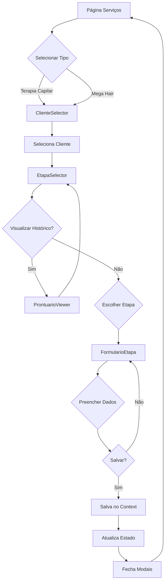
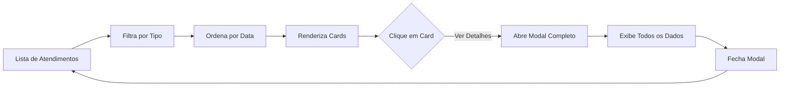

# 📋 Módulo de Serviços - Sistema de Gestão de Salão

## 📖 Visão Geral

O **Módulo de Serviços** é o coração do sistema de gestão especializada para salões de beleza, focado especificamente em **Terapia Capilar** e **Mega Hair**. Este módulo revoluciona a forma como profissionais registram e acompanham tratamentos capilares complexos, oferecendo flexibilidade total no preenchimento de prontuários através de um sistema de etapas independentes.

### 🎯 Objetivos Principais

- **Flexibilidade Total**: Permite preencher qualquer etapa do tratamento independentemente, sem ordem obrigatória
- **Histórico Completo**: Visualização integrada de todos os atendimentos anteriores do cliente
- **Registro Detalhado**: Captura completa de informações técnicas e clínicas em cada etapa
- **Rastreabilidade**: Acompanhamento de evolução de tratamentos ao longo do tempo
- **Profissionalismo**: Interface moderna e intuitiva que valoriza o trabalho especializado

---

## ⭐ Características Principais

### 1. **Sistema de Etapas Independentes**
```
🔍 Avaliação Inicial
   ├─ Anamnese completa
   ├─ Histórico capilar
   ├─ Estado atual do cabelo
   └─ Fotos de registro

💊 Seleção de Tratamento
   ├─ Escolha de produtos
   ├─ Técnicas a aplicar
   ├─ Planejamento do tratamento
   └─ Justificativa técnica

✨ Aplicação do Tratamento
   ├─ Produtos utilizados
   ├─ Procedimentos realizados
   ├─ Tempo de aplicação
   └─ Observações técnicas

🎯 Finalização
   ├─ Resultados obtidos
   ├─ Orientações ao cliente
   ├─ Agendamento de retorno
   └─ Fotos comparativas
```

### 2. **Histórico Integrado por Cliente**
- Visualização lateral de todos os atendimentos anteriores
- Filtro automático por tipo de serviço (Terapia Capilar / Mega Hair)
- Ordenação cronológica do mais recente para o mais antigo
- Acesso rápido a qualquer prontuário anterior com um clique
- Contador de vezes que cada etapa foi realizada

### 3. **Interface Dual (Histórico + Nova Etapa)**
```
┌─────────────────────────────────────────────────┐
│          TERAPIA CAPILAR - Cliente X            │
├────────────────┬────────────────────────────────┤
│   HISTÓRICO    │    NOVA ETAPA                  │
│   (40%)        │    (60%)                       │
├────────────────┼────────────────────────────────┤
│ 📋 18/11/2025  │  [🔍 Avaliação]  [💊 Seleção] │
│    Seleção     │                                │
│    💊 15:00    │  [✨ Aplicação]  [🎯 Final]   │
│                │                                │
│ 📋 15/11/2025  │  💡 Dica: Escolha livremente   │
│    Avaliação   │     qualquer etapa             │
│    🔍 14:30    │                                │
└────────────────┴────────────────────────────────┘
```

### 4. **Gestão Visual de Progresso**
- Badges indicando quantas vezes cada etapa foi realizada
- Ícones visuais para identificação rápida de etapas
- Cards coloridos por tipo de serviço
- Indicadores de data/hora em todos os registros

### 5. **Tipos de Atendimento Suportados**

#### 🌸 Terapia Capilar
- Tratamentos de hidratação, nutrição e reconstrução
- Terapias especializadas (botox, cauterização, etc.)
- Acompanhamento de tratamentos prolongados
- Registro fotográfico de evolução

#### 💇‍♀️ Mega Hair
- Medição e planejamento
- Confecção de mechas
- Aplicação e ajustes
- Manutenções periódicas

---

## 📁 Estrutura de Arquivos

```
src/
├── pages/
│   └── Servicos.jsx                          # 🎯 Componente principal
│
├── components/
│   └── terapiaCapilar/
│       ├── FormularioAvaliacaoInicial.jsx    # 🔍 Etapa 1
│       ├── FormularioSelecaoTratamento.jsx   # 💊 Etapa 2
│       ├── FormularioAplicacaoTratamento.jsx # ✨ Etapa 3
│       └── FormularioFinalizacao.jsx         # 🎯 Etapa 4
│
├── contexts/
│   └── SalaoContext.jsx                      # 📦 Gerenciamento de estado global
│
└── utils/
    └── masks.js                              # 🛠️ Funções utilitárias (getTodayBR)
```

---

## 🔍 Detalhamento dos Arquivos

### 📄 `Servicos.jsx` (Componente Principal)

**Responsabilidades:**
- Orquestração do fluxo completo de atendimento
- Gerenciamento de modais e navegação entre telas
- Integração com contexto global
- Renderização de histórico e estatísticas

**Componentes Internos:**

#### 1. **TipoAtendimentoSelector**
```javascript
// Seletor inicial de tipo de serviço
- Terapia Capilar (🌸)
- Mega Hair (💇‍♀️)
```
- **Props**: `onSelect(tipo)`
- **Função**: Primeira etapa do fluxo, define o tipo de atendimento

#### 2. **ClienteSelector**
```javascript
// Modal de seleção de cliente
- Busca por nome ou telefone
- Lista de clientes do salão
- Avatar inicial colorido
```
- **Props**: `clientes`, `onSelect(cliente)`, `onCancel()`
- **Função**: Segunda etapa, identifica o cliente

#### 3. **EtapaSelector**
```javascript
// Tela dual: Histórico + Seleção de Etapa
Lado Esquerdo (40%):
  - Histórico de atendimentos do cliente
  - Cards clicáveis para visualização
  - Ordenação cronológica

Lado Direito (60%):
  - 4 botões de etapas
  - Contadores de execuções
  - Descrições de cada etapa
```
- **Props**: `clienteSelecionado`, `tipoAtendimento`, `onSelectEtapa(etapa)`, `onCancel()`, `atendimentosAnteriores`
- **Função**: Visualizar histórico e escolher nova etapa

#### 4. **ProntuarioViewer**
```javascript
// Modal de visualização de prontuário anterior
- Header com etapa e data/hora
- Listagem de todos os campos preenchidos
- Botão de fechar
```
- **Props**: `prontuario`, `onClose()`
- **Função**: Exibir detalhes completos de um atendimento passado

#### 5. **FormularioEtapa**
```javascript
// Modal de preenchimento da etapa escolhida
- Renderização dinâmica do formulário correto
- Gerenciamento de estado do formulário
- Salvamento de prontuário
```
- **Props**: `clienteSelecionado`, `tipoAtendimento`, `etapaSelecionada`, `onClose()`, `onSave(prontuario)`, `produtos`
- **Função**: Capturar dados da etapa selecionada

#### 6. **AtendimentoCard**
```javascript
// Card de atendimento no histórico principal
- Informações do cliente e data/hora
- Badge da etapa realizada
- Preview de objetivo/observações
- Link para visualização completa
```
- **Props**: `atendimento`, `cliente`, `onViewDetails()`
- **Função**: Exibir resumo de atendimento na lista principal

---

### 📄 `FormularioAvaliacaoInicial.jsx`

**Campos Principais:**
```javascript
{
  // Identificação
  dataNascimento: string,
  profissao: string,
  
  // Histórico Capilar
  historicoCapilar: text,
  quimicasAnteriores: text,
  problemasPrincipais: text,
  
  // Avaliação Física
  tipoCabelo: select,
  textura: select,
  espessuraFio: select,
  porosidade: select,
  elasticidade: select,
  
  // Estado Atual
  estadoCouروCabeludo: text,
  condicaoFios: text,
  presencaQuimica: boolean,
  
  // Observações
  alergias: text,
  medicamentos: text,
  objetivoTratamento: text,
  
  // Fotos
  fotosAntes: array<File>
}
```

**Validações:**
- Campos obrigatórios marcados
- Validação de data de nascimento
- Limite de fotos (geralmente 4-6)

---

### 📄 `FormularioSelecaoTratamento.jsx`

**Campos Principais:**
```javascript
{
  // Diagnóstico
  diagnosticoTecnico: text,
  necessidadesIdentificadas: text,
  
  // Tratamento
  tratamentoSelecionado: select,
  tecnicaAplicacao: text,
  produtosPrincipais: multiselect,
  produtosComplementares: multiselect,
  
  // Planejamento
  tempoPrevisto: number,
  numeroSessoes: number,
  intervaloSessoes: string,
  
  // Justificativa
  motivoEscolha: text,
  resultadosEsperados: text,
  contraindicacoes: text,
  
  // Aprovação
  clienteAprovouPlano: boolean,
  observacoesCliente: text
}
```

**Integrações:**
- Lista de produtos cadastrados no estoque
- Sugestões baseadas em histórico
- Cálculo automático de duração total do tratamento

---

### 📄 `FormularioAplicacaoTratamento.jsx`

**Campos Principais:**
```javascript
{
  // Produtos Aplicados
  produtosUtilizados: array<{
    produto: id,
    quantidade: string,
    marca: string
  }>,
  
  // Procedimento
  etapasProcedimento: text,
  temperaturasUtilizadas: text,
  tempoAplicacao: {
    lavagem: number,
    aplicacao: number,
    pausaTecnica: number,
    finalizacao: number
  },
  
  // Técnica
  tecnicaAplicada: text,
  equipamentosUsados: array<string>,
  
  // Durante Aplicação
  reacoesObservadas: text,
  ajustesRealizados: text,
  
  // Resultado Imediato
  resultadoAposAplicacao: text,
  nivelSatisfacao: rating,
  
  // Fotos
  fotosDurante: array<File>,
  fotosDepois: array<File>
}
```

**Recursos Especiais:**
- Timer integrado para cada etapa
- Checklist de procedimentos
- Alertas de tempo de pausa

---

### 📄 `FormularioFinalizacao.jsx`

**Campos Principais:**
```javascript
{
  // Resultados
  resultadosObtidos: text,
  objetivosAlcancados: array<checkbox>,
  melhorasPercebidas: text,
  
  // Feedback do Cliente
  satisfacaoCliente: rating,
  comentariosCliente: text,
  
  // Orientações
  cuidadosDomiciliares: text,
  produtosRecomendados: array<string>,
  frequenciaLavagem: string,
  produtosEvitar: text,
  
  // Manutenção
  dataRetornoSugerida: date,
  proximaEtapa: text,
  observacoesManutencao: text,
  
  // Avaliação Profissional
  avaliacaoTecnica: text,
  pontosAtencao: text,
  recomendacoesFuturas: text,
  
  // Fotos Finais
  fotosComparacao: array<{
    antes: File,
    depois: File
  }>
}
```

**Recursos Especiais:**
- Comparação lado a lado de fotos antes/depois
- Geração automática de data de retorno
- Impressão de orientações para o cliente

---

### 📄 `SalaoContext.jsx`

**Estado Global Gerenciado:**
```javascript
{
  salaoAtual: {
    id: number,
    nome: string,
    // ... outros dados
  },
  
  prontuarios: array<{
    id: number,
    salaoId: number,
    clienteId: number,
    tipo: 'terapia_capilar' | 'mega_hair',
    data: string, // formato DD/MM/YYYY
    hora: string, // formato HH:MM
    etapaPreenchida: 'avaliacao' | 'selecao' | 'aplicacao' | 'finalizacao',
    etapasCompletas: array<string>,
    dadosTerapiaCapilar: object,
    dadosMegaHair: object
  }>,
  
  clientes: array<Cliente>,
  produtos: array<Produto>
}
```

**Métodos Principais:**
```javascript
// Filtros
getClientesPorSalao(): Cliente[]
getProntuariosPorSalao(): Prontuario[]
getProdutosPorSalao(): Produto[]

// Mutações
setProntuarios(novoProntuarios: Prontuario[]): void
adicionarProntuario(prontuario: Prontuario): void
atualizarProntuario(id: number, dados: Partial<Prontuario>): void
```

---

## 🔄 Fluxo de Dados

### 1️⃣ Fluxo de Criação de Atendimento



### 2️⃣ Fluxo de Visualização de Histórico



### 3️⃣ Fluxo de Dados entre Componentes

```
SalaoContext (Global State)
    ↓
Servicos.jsx (Componente Principal)
    ↓
    ├─→ TipoAtendimentoSelector
    │       ↓
    ├─→ ClienteSelector
    │       ↓
    ├─→ EtapaSelector
    │       ├─→ Histórico (Lado Esquerdo)
    │       │       ↓
    │       │   ProntuarioViewer
    │       │
    │       └─→ Seleção de Etapa (Lado Direito)
    │               ↓
    └─→ FormularioEtapa
            ├─→ FormularioAvaliacaoInicial
            ├─→ FormularioSelecaoTratamento
            ├─→ FormularioAplicacaoTratamento
            └─→ FormularioFinalizacao
                    ↓
            onSave(prontuario)
                    ↓
            SalaoContext.setProntuarios()
                    ↓
            Atualização Global
```

### 4️⃣ Estrutura de Dados de um Prontuário

```javascript
{
  // Metadados
  id: 1,
  salaoId: 1,
  clienteId: 5,
  tipo: 'terapia_capilar',
  
  // Timestamp
  data: '21/11/2025',
  hora: '14:30',
  
  // Controle de Etapas
  etapaPreenchida: 'avaliacao',
  etapasCompletas: ['avaliacao'],
  
  // Dados Específicos (estrutura varia por etapa)
  dadosTerapiaCapilar: {
    // Campos do formulário preenchido
    objetivoTratamento: 'Hidratação profunda',
    tipoCabelo: 'Ondulado',
    porosidade: 'Alta',
    // ... mais campos
  }
}
```

---

## 🚀 Roadmap de Melhorias

### 🎯 Curto Prazo (1-2 meses)

#### 1. **Sistema de Busca e Filtros Avançados**
```javascript
// Implementar
- Busca por data/período
- Filtro por etapa específica
- Filtro por produto utilizado
- Busca por palavra-chave nas observações
- Exportação de relatórios filtrados
```

#### 2. **Comparação de Fotos Melhorada**
```javascript
// Recursos
- Slider antes/depois interativo
- Zoom sincronizado em ambas as fotos
- Marcações e anotações nas imagens
- Galeria cronológica de evolução
- Compartilhamento seguro com cliente
```

#### 3. **Notificações e Lembretes**
```javascript
// Alertas
- Lembrete de retorno do cliente
- Alertas de manutenção necessária
- Notificação de produtos em falta
- Lembretes de reavaliação periódica
```

#### 4. **Templates de Tratamento**
```javascript
// Criação de templates
- Salvar combinações de produtos frequentes
- Templates por tipo de problema capilar
- Clonagem de tratamentos bem-sucedidos
- Biblioteca de protocolos técnicos
```

### 🎯 Médio Prazo (3-6 meses)

#### 5. **Dashboard Analítico**
```javascript
// Métricas
- Tratamentos mais realizados
- Taxa de retorno de clientes
- Efetividade por tipo de tratamento
- Tempo médio por etapa
- Produtos mais utilizados
- Gráficos de evolução
```

#### 6. **Sistema de Agendamento Integrado**
```javascript
// Funcionalidades
- Agendar próxima sessão direto da finalização
- Calendário de retornos
- Lembretes automáticos para cliente
- Sincronização com agenda principal
- Bloqueio de horários por duração estimada
```

#### 7. **Prontuário Colaborativo**
```javascript
// Múltiplos profissionais
- Assinatura digital por etapa
- Histórico de edições
- Comentários entre profissionais
- Aprovações de supervisores
- Auditoria completa de alterações
```

#### 8. **Integração com Estoque**
```javascript
// Controle automático
- Baixa automática de produtos ao salvar aplicação
- Alertas de estoque baixo
- Sugestão de produtos alternativos
- Histórico de consumo por tratamento
- Cálculo de custo real por atendimento
```

### 🎯 Longo Prazo (6-12 meses)

#### 9. **Inteligência Artificial**
```javascript
// IA Sugestiva
- Sugestão de tratamentos baseada em histórico
- Previsão de resultados
- Identificação de padrões de sucesso
- Alertas de possíveis problemas
- Recomendações personalizadas por cliente
```

#### 10. **Portal do Cliente**
```javascript
// Acesso do cliente
- Visualizar próprio histórico (sanitizado)
- Ver fotos de evolução
- Acessar orientações de cuidados
- Confirmar agendamentos
- Avaliar resultados
- Chat com profissional
```

#### 11. **Sistema de Certificação**
```javascript
// Controle de qualidade
- Checklists de procedimentos obrigatórios
- Certificação de conclusão de tratamento
- Emissão de laudos técnicos
- Conformidade com protocolos
- Registro de capacitações da equipe
```

#### 12. **Backup e Sincronização em Nuvem**
```javascript
// Segurança dos dados
- Backup automático diário
- Sincronização entre dispositivos
- Acesso offline com sincronização posterior
- Versionamento de prontuários
- Recuperação de dados deletados (até 30 dias)
```

#### 13. **Relatórios Personalizados**
```javascript
// Geração de relatórios
- Relatório individual por cliente
- Relatório de efetividade de produtos
- Análise financeira de tratamentos
- Relatório de satisfação
- Exportação em PDF/Excel
- Gráficos customizáveis
```

#### 14. **Integração com Marketing**
```javascript
// Comunicação com cliente
- Envio de certificados de tratamento
- Fotos antes/depois para portfólio (com autorização)
- Depoimentos estruturados
- Materiais educativos automáticos
- Campanhas de retorno personalizadas
```

### 🎯 Recursos Avançados (Futuro)

#### 15. **Modo Offline Completo**
```javascript
// PWA robusto
- Funcionalidade completa offline
- Sincronização inteligente ao reconectar
- Resolução de conflitos automática
- Armazenamento local otimizado
```

#### 16. **Análise de Imagens com IA**
```javascript
// Processamento de fotos
- Detecção automática de problemas capilares
- Medição de volume/brilho/textura
- Comparação quantitativa antes/depois
- Sugestões baseadas em análise visual
- Padronização de fotos (iluminação, ângulo)
```

#### 17. **Integração com Laboratórios**
```javascript
// Troca de informações
- Envio de análises para laboratório parceiro
- Recebimento de laudos técnicos
- Integração de exames tricológicos
- Histórico de análises laboratoriais
```

#### 18. **Gamificação para Clientes**
```javascript
// Engajamento
- Pontos por seguir orientações
- Badges de evolução
- Desafios de cuidados
- Recompensas por fidelidade
- Compartilhamento de conquistas
```

---

## 🔒 Segurança e Privacidade

### Medidas Implementadas
- ✅ Dados armazenados localmente por salão
- ✅ Isolamento de dados entre salões diferentes
- ✅ Imagens armazenadas com referências seguras

### Melhorias Futuras
- 🔄 Criptografia de dados sensíveis
- 🔄 Autenticação de dois fatores
- 🔄 Logs de auditoria completos
- 🔄 Termo de consentimento para fotos
- 🔄 Conformidade com LGPD
- 🔄 Anonimização de dados para análises

---

## 🧪 Testes e Qualidade

### Cenários de Teste Recomendados

#### 1. Fluxo Completo
```
✓ Selecionar Terapia Capilar
✓ Escolher cliente existente
✓ Visualizar histórico vazio
✓ Preencher Avaliação Inicial
✓ Salvar com sucesso
✓ Verificar aparição no histórico
```

#### 2. Múltiplas Etapas
```
✓ Criar atendimento com Avaliação
✓ Criar novo atendimento com Seleção (mesmo cliente)
✓ Verificar contadores de etapas
✓ Visualizar ambos no histórico
✓ Abrir prontuário anterior
```

#### 3. Validações
```
✓ Tentar salvar formulário vazio
✓ Campos obrigatórios destacados
✓ Validação de datas
✓ Limite de upload de imagens
✓ Mensagens de erro claras
```

#### 4. Navegação
```
✓ Cancelar em cada modal
✓ Voltar para seleção de cliente
✓ Fechar visualização de prontuário
✓ Verificar estado após cancelamento
```

---

## 📊 Métricas de Sucesso

### KPIs do Módulo
- **Tempo médio de preenchimento** por etapa
- **Taxa de completude** de prontuários
- **Número de fotos** registradas por tratamento
- **Frequência de uso** de cada etapa
- **Taxa de retorno** de clientes
- **Satisfação** dos profissionais com o sistema

---

## 🛠️ Tecnologias Utilizadas

### Frontend
- **React** 18+ - Biblioteca principal
- **Lucide React** - Ícones modernos
- **Tailwind CSS** - Estilização utilitária
- **Context API** - Gerenciamento de estado

### Padrões e Práticas
- **Component Composition** - Componentes reutilizáveis
- **Controlled Components** - Formulários controlados
- **Prop Drilling com Context** - Evitar prop drilling excessivo
- **Memoization** - useMemo para otimização
- **Separation of Concerns** - Componentes focados

---

## 📚 Guia de Implementação

### Para Desenvolvedores

#### 1. Adicionar Nova Etapa
```javascript
// 1. Criar componente em src/components/terapiaCapilar/
export const FormularioNovaEtapa = ({ formData, onChange }) => {
  return (
    <div>
      {/* Seus campos aqui */}
    </div>
  );
};

// 2. Adicionar no EtapaSelector
const etapas = [
  // ... etapas existentes
  { 
    id: 'nova_etapa', 
    nome: 'Nova Etapa', 
    icon: '🆕',
    descricao: 'Descrição da nova etapa'
  }
];

// 3. Adicionar no renderFormulario() do FormularioEtapa
case 'nova_etapa':
  return <FormularioNovaEtapa {...props} />;
```

#### 2. Adicionar Novo Tipo de Serviço
```javascript
// 1. Atualizar TipoAtendimentoSelector
<button onClick={() => onSelect('novo_servico')}>
  {/* Configuração do novo serviço */}
</button>

// 2. Criar componentes de formulário específicos
// 3. Ajustar filtros e lógica de visualização
// 4. Atualizar contexto se necessário
```

#### 3. Personalizar Campos
```javascript
// Todos os formulários seguem a estrutura:
const Formulario = ({ formData, onChange, onImagensChange }) => {
  // formData: objeto com valores atuais
  // onChange: (e) => void - para inputs padrão
  // onImagensChange: (campo, imagens) => void - para uploads
  
  return (
    <div className="space-y-4">
      <input
        name="campo"
        value={formData.campo || ''}
        onChange={onChange}
      />
    </div>
  );
};
```

---

## 🎨 Personalização Visual

### Paleta de Cores

```css
/* Terapia Capilar */
--therapy-primary: #9333EA;    /* Purple-600 */
--therapy-secondary: #EC4899;  /* Pink-600 */
--therapy-light: #F3E8FF;      /* Purple-50 */

/* Mega Hair */
--mega-primary: #2563EB;       /* Blue-600 */
--mega-secondary: #4F46E5;     /* Indigo-600 */
--mega-light: #EFF6FF;         /* Blue-50 */

/* Status */
--success: #10B981;            /* Green-500 */
--warning: #F59E0B;            /* Amber-500 */
--error: #EF4444;              /* Red-500 */
```

### Customização de Temas
```javascript
// Adicionar em Servicos.jsx
const temas = {
  terapia_capilar: {
    gradient: 'from-purple-600 to-pink-600',
    border: 'border-purple-200',
    bg: 'bg-purple-50',
    // ...
  },
  mega_hair: {
    gradient: 'from-blue-600 to-indigo-600',
    // ...
  }
};
```

---

## 🤝 Contribuindo

### Diretrizes
1. Manter consistência visual entre componentes
2. Seguir padrão de nomenclatura de props
3. Documentar componentes complexos
4. Adicionar tratamento de erros
5. Testar em diferentes resoluções
6. Considerar acessibilidade (a11y)

### Checklist para PRs
- [ ] Código sem warnings no console
- [ ] Responsivo (mobile, tablet, desktop)
- [ ] Funciona com dados vazios
- [ ] Validações implementadas
- [ ] Mensagens de erro claras
- [ ] Performance otimizada

---